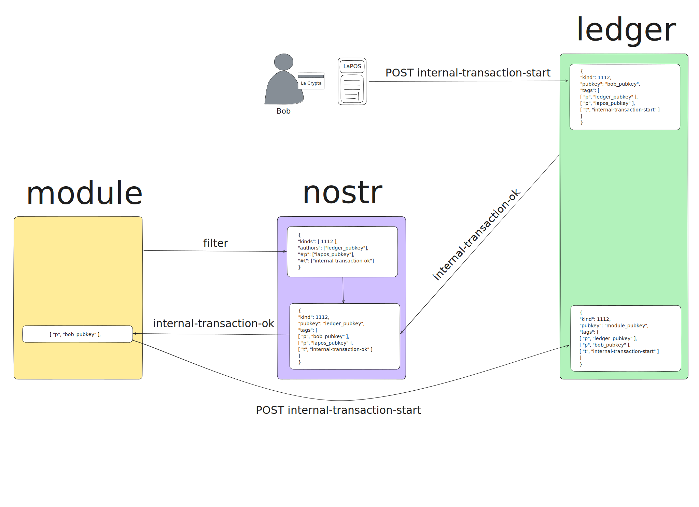

# Cash Back Module for LaWallet

<!--  -->


This module is used to send cashback to users who purchase with LaWallet through LaPOS using LaCard.

## Table of Contents

-   [Flow](#flow)
-   [Configuration](#configuration)
-   [To Do](#to-do)

## Flow

1. **Bob** pays with **LaCard** in **LaPOS** (only payments with **LaCard** are valid, payments with QR code don't work).
2. **LaPOS** sends an HTTP `POST` request to the `/publish` endpoint of LaWallet with`internal-transaction-start`, containing **Bob**'s payment to **LaPOS**
3. **Ledger** recive the payment and confirms it by sending `internal-transaction-ok` to LaWallet relay (`wss://relay.lawallet.ar`).
4. The **cash-back module** subscribes to LaWallet relay to listen for `internal-transaction-ok` emmited by the **Ledger** and directed to **LaPOS**.
5. The **module** receives the `internal-transaction-ok`.
6. The **module** sends an HTTP `POST` request to `/publish` endpoint of LaWallet with `internal-transaction-start`, containing the cashback for **Bob**.
7. **Ledger** send `internal-transaction-ok` to LaWallet relay and **Bob** recive your cash-back. (Don't showing in the map).

> NOTE: The **cash-back module** MUST have a LaWallet account.



## Configuration

### 1. Setup environment variables

Copy `.env.example` to `.env` and fill the `MODULE_PRIVATE_KEY` with the private key of LaWallet account

> It's necessary to have a LaWallet account to send internal transactions.

```bash
cp .env.example .env
```

### 2. Setup

Use correct node version

```bash
nvm use
```

Install the dependencies

```bash
pnpm i
```

### 3. Run in dev mode

```bash
pnpm dev
```

## To Do

-   [ ] Check minimum amount of cash-back
-   [ ] Add database
-   [ ] Environment variables
    -   [ ] Add list of volunteers walias
    -   [ ] Add cash-back percentages (normal and volunteers)
-   [ ] Setup volunteers in db (pubkey and sats of voucher)
-   [ ] makeEvent
    -   [ ] Volunteers handle
        -   [ ] Search in db
        -   [ ] Handle sats remaining
    -   [ ] Encrypt metadata of conent of event for the ledger send interal transaction
    -   [ ] Save id of payments to LaPOS in db
    -   [ ] Save the last timestamp of the last payment in db
-   [ ] Subscribe to relay with the last timestamp
